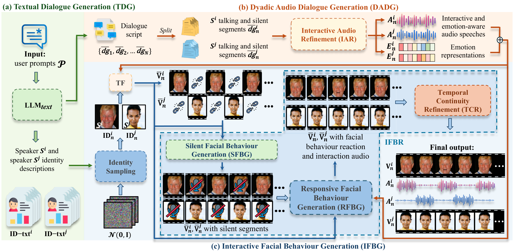

<p align="center">
  
</p>

<h1 align="center">CHAT: Conversational Human Audio-visual Talking Dialogue Generation</h1>

<div align="center">
Junhao Song<sup>1</sup> &emsp;
Lluis Guasch<sup>1</sup> &emsp;
Xilin He<sup>2</sup> &emsp;
Zhongyu Yang<sup>3</sup> &emsp;
Yingfang Yuan<sup>4</sup> &emsp;
Weicheng Xie<sup>5</sup>
</div>
<div align="center">
Linlin Shen<sup>5</sup> &emsp;
Haijun Lin<sup>6</sup> &emsp;
Shizhe Liu<sup>7</sup> &emsp;
Wei Pang<sup>3</sup> &emsp;
Siyang Song<sup>8,&dagger;</sup>
</div>

<br>

<div align="center">
<sup>1</sup>Imperial College London &emsp;
<sup>2</sup>Mohamed bin Zayed University of Artificial Intelligence &emsp;
<sup>3</sup>Heriot-Watt University
</div>
<div align="center">
<sup>4</sup>Northumbria University &emsp;
<sup>5</sup>Shenzhen University &emsp;
<sup>6</sup>Hunan Normal University &emsp;
<sup>7</sup>University of Oxford &emsp;
<sup>8</sup>University of Exeter
</div>

<br>

<div align="center">

[](https://link.springer.com/chapter/10.1007/978-3-032-37252-9_33)
[](https://arxiv.org/abs/2607.02799)
[](https://junhaosong.com/chat/)
[](https://youtu.be/VCSAmHkA_wo)
[](LICENSE)
[](https://github.com/Rqcker/chat/releases/tag/v1.0.0)

</div>

## 📖 Introduction

Collecting dyadic interactive audio-visual dialogue (DIAD) data is slow, expensive
and ethically sensitive, which is why public corpora stay small and
demographically narrow. **CHAT** generates it instead: from one textual prompt it
produces paired, mutually responsive speech-face dialogue clips for two speakers,
where the listener reacts to the speaker inside the same clip.

This is the reference implementation of CHAT, versioned and released on its own
cadence. [`DOCS.md`](DOCS.md) covers the implementation choices behind each module,
how they relate to the paper's description, and the evaluation protocol.
Per-release measurements ship with each
[release](https://github.com/Rqcker/chat/releases), and
[`CHANGELOG.md`](CHANGELOG.md) records what every version changes.

## 🏗️ Framework

<p align="center">
  
</p>

Three modules run in sequence. **TDG** turns one prompt into `N` dialogue scripts
of 5–10 turns plus a textual identity descriptor per speaker. **DADG** synthesises
the two speech tracks and lays them on one shared timeline, with **IAR** adding
per-sentence emotion, prosody and interactive back-channels. **IFBG** renders both
faces, and **IFBR** refines them: RFBG conditions each speaker's window on the
partner's, SFBG fills silent segments, and TCR blends segment boundaries.

## ⚙️ Installation

Three environments, because their dependencies conflict. Versions are the ones the
reported numbers were measured under.

```bash
conda create -n chat  python=3.11.15 && conda activate chat  && pip install -r requirements/chat.txt
conda create -n tts   python=3.11.15 && conda activate tts   && pip install -r requirements/tts.txt
conda create -n video python=3.10.20 && conda activate video && pip install -r requirements/video.txt
```

Install a `torch` wheel matching your CUDA version rather than taking the pin
literally. Third-party checkouts (Hallo2, Arc2Face, XTTS-v2) are not pip
dependencies; see [`DOCS.md`](DOCS.md#third-party-components).

## 🚀 Quick start

```bash
export CHAT_ASSETS=/path/to/third-party-checkouts-and-data
export CHAT_CONDA_SH=$HOME/miniconda3/etc/profile.d/conda.sh
export COQUI_TOS_AGREED=1        # only after reading the XTTS-v2 licence
export CHAT_HDTF_DIR=/path/to/hdtf/clips_extracted
bash scripts/x1_gen_core.sh "Two friends catching up over coffee." out_dir 0
```

`x1_gen_core.sh` chains stages 1 to 5 and takes every machine-specific location
from an environment variable. It is the script every default-path number was
produced with.

Voice cloning needs one reference clip per speaker. The script falls back to two
clips inside the Hallo2 checkout, so stage 2 needs that checkout even though it is
otherwise a stage 4 dependency. Set `CHAT_VOICE_I` and `CHAT_VOICE_J` to your own
references to avoid this.

This path reads identity frames from HDTF, a licensed corpus that is not
redistributed here. Without it, run stage 3 as
`python scripts/x1_faces.py --script script.json` with no `--hdtf-dir`, which is
the paper's generated-descriptor path.

## 🧩 Released weights

| File | What it is |
|---|---|
| `checkpoints/rfbg_qknorm_ft_030500.pt` | RFBG: HDTF cold start, then a dyadic fine-tune on NoXI |
| `checkpoints/sfbg_pre_020000.pt` | SFBG: 20k-step HDTF cold start |

Both are refinement blocks — four-layer, 128-wide transformers over 4-channel
SD1.5 VAE latents — not generators. The generator is Hallo2, which is frozen,
installed separately and not redistributed here. Each checkpoint stores its own
config, so the architecture is read from the file rather than assumed. Provenance,
integrity hashes and training scale are in
[`checkpoints/README.md`](checkpoints/README.md).

## ⚖️ Responsible use

CHAT exists to reduce reliance on real dyadic recordings, which the paper
describes as costly and ethically sensitive to collect. Use it that way.

**Do not generate speech or facial behaviour attributed to a real person without
that person's consent, and do not present output as a genuine recording.** The
pipeline animates a face from one reference image and clones a voice from one
reference clip, so it can be pointed at a real identity as easily as a generated
one. `--face-i/--face-j` and `--voice-i/--voice-j` take arbitrary files; that is
what this notice is about.

The evaluation protocol reads identity frames from HDTF, which contains real,
identifiable people. HDTF is licensed and is not redistributed here. Nothing in
this repository ships a face, a voice or a clip of any real person. For the
paper's own synthetic-identity path, run `x1_faces.py --script` without
`--hdtf-dir`.

CHAT-AVD-50k is released separately, with provenance metadata and bias auditing.

## 📄 Licence

The code in this repository is MIT (see [`LICENSE`](LICENSE)).

The two files under `checkpoints/` are **not** covered by that grant. They are
released for non-commercial research use only under
[`checkpoints/LICENSE`](checkpoints/LICENSE), and are derived from HDTF and NoXI,
whose own terms bind any use of them. Third-party components are installed
from their own sources under their own licences and are not redistributed here;
Stable Diffusion 1.5 carries CreativeML OpenRAIL-M use restrictions, and XTTS-v2
carries the Coqui Public Model Licence, which you must read and accept yourself.

## 📝 Citation

```bibtex
@inproceedings{song2026chat,
  title     = {Conversational Human Audio-visual Talking Dialogue Generation},
  author    = {Song, Junhao and Guasch, Lluis and He, Xilin and Yang, Zhongyu and
               Yuan, Yingfang and Xie, Weicheng and Shen, Linlin and Lin, Haijun and
               Liu, Shizhe and Pang, Wei and Song, Siyang},
  booktitle = {Computer Vision -- ECCV 2026},
  year      = {2026},
  publisher = {Springer Nature Switzerland},
  address   = {Cham},
  pages     = {597--616},
  doi       = {10.1007/978-3-032-37252-9_33}
}
```
